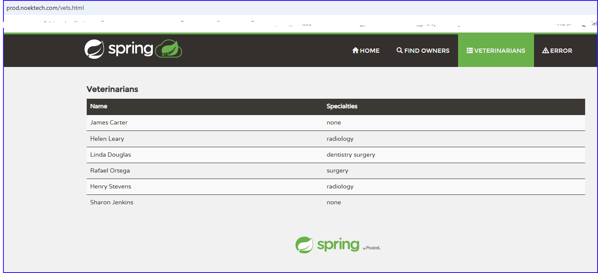

## End-to-End Auto-Discovery Project

## Project Overview and Tech Stack used

The aim of this project was to deploy a highly available, self-healing, scalable, and secured containerized Java application using a Jenkins pipeline and AWS. The tech stack used for this project is 1. Terraform to set up infrastructure as code. Modules was used in this project to keep the code maintainable, reusable and simple to comprehend, 2. AWS cloud environment where the application was deployed in, 3. Git, which is a version control tool, 4. Bastion host to ssh into the resources, 5. Jenkins as a CI/CD tool, 6. Ansible as a configuration and application deployment tool, 7. Sonarqube for code analysis and coverage, 8. Docker as the containerization tool, 9. S3 bucket to store the Terraform statefile, 10. DynamoDP  to lock the statefile, 11. Hashicorp Vault to securely manage database credentials, 12.Newrelic as a monitoring tool, 13. Nexus repository as an artifact storage and a docker hub, 14. Auto Scaling Group to launch instances from the staging environment to the production environment and 14. Slack for communication and receiving notifications, 16. Trivy, a container vulnerability scanner to help to ensure that the Docker containers used by Jenkins are free of known security vulnerabilities.

Architectural Diagram

## Project Steps

## Github Repository and Modules

First a Github repository was created for the project where the final, working code was regularly pushed to. After this modules were created in Terraform one by one, so that each module could be tested seperately until it worked, before moving on to the next module. This way any errors were easier to detect and fix. Most modules include main.tf, variables.tf, and outputs.tf to ensure modularity, reusability, and clarity in Terraform configurations. Main.tf contains the core infrastructure resources and logic of the module. It defines what resources are created, such as EC2 instances, VPCs, or security groups. Variables.tf is used to define the input variables for the module, allowing users to customize the module’s behavior and make it reusable across different environments by passing different values for these variables. Output.tf defines the output values of the module, which can be referenced by other parts of the infrastructure. These outputs provide useful information, such as instance IPs or resource IDs, for use elsewhere in the Terraform configuration.

## GitIgnore File

 A .gitignore file was added outside the modules. This file is used to specify intentionally untracked files that Git should ignore once the "terraform apply" command is executed, or that Git should not tracke or include in the repository, either because they are not necessary for version control or because they may contain sensitive or environment-specific data.

## VPC

The first module created was the Virtual Private Cloud (VPC) is a logically isolated section of the AWS cloud where one can define their own virtual network, including IP address ranges, subnets, route tables, and network gateways. A VPC was created in Terraform for this project to manage resource isolation and traffic flow. Both public and private subnets were set up, each associated with dedicated route tables: the public subnets routed traffic to an Internet Gateway (IGW) for external access, while private subnets directed outbound internet traffic through a NAT Gateway to maintain security. An Elastic IP was assigned to the NAT Gateway for consistent connectivity. Public subnets were used for resources requiring internet exposure, such as load balancers, while private subnets hosted sensitive resources like databases. This architecture was designed to ensure a secure and scalable environment, adhering to best practices for network segmentation and resource accessibility.

## HashiCorp Vault

The second module to be created was Vault, to securely manage secrets and sensitive data. The Vault infrastructure was implemented as a standalone module to ensure reusability, and maintainability. By isolating Vault into its own Terraform module, it becomes easier to manage and scale independently of other resources. This approach allows the module to be reused across different environments e.g., development, staging, production with minimal changes by simply modifying input variables. Additionally, separating Vault into a standalone module enhances security and clarity, as it encapsulates all the configurations, policies, and dependencies specific to Vault. This structure reduces the risk of unintended changes affecting unrelated components and aligns with Terraform best practices by promoting a clean and organized codebase. It also simplifies integration with other infrastructure by exposing only the necessary outputs, such as the Vault server's endpoint or DNS name, while keeping its internal configurations abstracted.

An AWS provider was configured for the eu-west-3 region, with an S3 backend and DynamoDB table for storing the Terraform state, ensuring remote state management and locking. A secure EC2 instance was provisioned as the Vault server, using a custom Ubuntu AMI and deployed in a public subnet with a public IP address for accessibility. The instance was secured with a dedicated security group allowing only necessary traffic, such as SSH (port 22) and Vault API (port 8200).

A KMS key was set up for encryption to enhance security, and Route 53 DNS records were configured to associate the Vault server with a custom domain, improving usability. An SSL certificate was created and validated for secure HTTPS communication. For high availability and load distribution, an Elastic Load Balancer (ELB) was deployed with cross-zone load balancing and health checks to monitor the Vault server's status.

Additionally, a dynamically generated key pair ensured secure access to the instance, with the private key securely stored locally. This infrastructure setup provided a robust, scalable, and secure environment for managing secrets with Vault while adhering to best practices for security and automation.

## Create_s3bucket.sh and Delete_s3bucket.sh Scripts

The create_s3bucket.sh and delete_s3bucket.sh scripts were designed as standalone scripts to simplify the creation and deletion of the S3 bucket and DynamoDB table required for Terraform's remote state management. This modular approach ensures flexibility, enabling these resources to be managed independently when setting up or tearing down infrastructure.

create_s3bucket.sh
The create_s3bucket.sh script is responsible for provisioning the S3 bucket and DynamoDB table used by Terraform. The script begins by creating an S3 bucket in the specified region (eu-west-3) and applies tags to identify its purpose as a remote state storage resource. It then creates a DynamoDB table for state locking, using a LockID attribute to prevent concurrent operations on the Terraform state. By encapsulating these steps in a single script, the process of setting up remote state management becomes automated, repeatable, and less error-prone.

delete_s3bucket.sh
The delete_s3bucket.sh script ensures clean removal of the remote state resources when they are no longer needed. It first deletes all objects within the S3 bucket to avoid errors during bucket deletion. The script then deletes the S3 bucket itself, followed by the DynamoDB table. This sequence ensures a safe and thorough cleanup, preventing leftover resources that could incur costs or cause conflicts in future deployments.

## KeyPair

The keypair module was created to securely generate and manage SSH key pairs for accessing EC2 instances. An RSA private key with 4096-bit encryption was created and stored locally with restricted permissions. The corresponding public key was uploaded to AWS as an EC2 key pair, enabling secure SSH access to instances. This module was integrated into the overall infrastructure to ensure consistent key management, improve security by automating key creation, and streamline the process of accessing EC2 instances without manual intervention.

## Bastion Host

The bastion-host module was created to provision a secure EC2 instance for managing access to private resources within a VPC. The aws_instance resource was configured to launch a Red Hat-based EC2 instance of type t2.micro in a specified subnet with a public IP address. The instance used a specified key pair for SSH access and was associated with a security group that allowed SSH access on port 22 from any IP address. The instance was also tagged with a name for easy identification.

A corresponding aws_security_group resource was created for the bastion host, which allowed inbound SSH traffic on port 22 from any IP address and allowed all outbound traffic. This security group was applied to the bastion instance, ensuring proper network security and access control.

This setup was added to provide a secure and controlled way to access instances in private subnets, ensuring proper isolation and reducing exposure to the public internet.

## Sonarqube

The EC2 Instance for SonarQube module was created to provision an EC2 instance that hosted a SonarQube application. The aws_instance resource was configured with an Ubuntu AMI and a specified instance type. The instance was placed in a designated subnet and associated with a security group that allowed inbound SSH access for management and HTTP/HTTPS access for the SonarQube application. It also used a public key for SSH access and was initialized with custom user data for SonarQube configuration.

An ELB (Elastic Load Balancer) was created to distribute traffic to the SonarQube instance, ensuring high availability. The aws_elb resource was configured to listen on HTTPS (port 443) and forward traffic to SonarQube on port 9000. It included health checks to ensure the instance was healthy and could serve traffic properly, and enabled cross-zone load balancing and connection draining for improved fault tolerance.

The Security Group for SonarQube was defined using the aws_security_group resource. This security group allowed inbound traffic on ports 22 (SSH), 9000 (SonarQube), and 443 (HTTPS), while permitting all outbound traffic. This ensured secure access to SonarQube for both administrative and user access.

Additionally, a Route 53 DNS record was created for SonarQube by using the aws_route53_record resource, which linked the SonarQube ELB to a custom domain, making it accessible through a friendly URL.

This setup was added to provide a fully functional, scalable SonarQube deployment, accessible via a secure, load-balanced endpoint.

## Nexus

The Nexus server module was created to provision an EC2 instance to run the Nexus repository manager. The aws_instance resource was configured with a Red Hat-based AMI and an instance type specified in the variables. It was placed in a designated subnet, associated with a security group that allowed inbound traffic for Nexus on ports 8081 (HTTP), 8085, and 443 (HTTPS), and SSH access on port 22. The instance also used a public key for SSH access and was initialized with custom user data for Nexus configuration.

An Elastic Load Balancer (ELB) was created to distribute HTTPS traffic to the Nexus instance, ensuring high availability and security. The aws_elb resource was configured with an SSL certificate and health checks to monitor the Nexus instance's availability on port 8081. The load balancer was configured with cross-zone load balancing and connection draining, improving fault tolerance.

The Security Group for Nexus was defined using the aws_security_group resource, allowing inbound traffic for Nexus on ports 8081, 8085, and 443, as well as SSH access on port 22. The security group also allowed all outbound traffic, ensuring the Nexus instance could communicate with other services as needed.

Additionally, a Route 53 DNS record was created for Nexus using the aws_route53_record resource, which linked the Nexus ELB to a custom domain, making Nexus accessible through a friendly URL.

This setup was added to provide a secure and scalable Nexus repository, accessible via a secure, load-balanced endpoint for artifact management.

## Jenkins

The Jenkins module was created, with the configuration designed to set up a fully functional Jenkins server on AWS. The process began with the creation of an EC2 instance using a Red Hat-based AMI, specified instance type, subnet ID, and a public key for SSH access. This instance was associated with a security group, jenkins_sg, which allowed inbound traffic on the necessary ports: 8080 for HTTP, 443 for HTTPS, and 22 for SSH. The security group provided a controlled network environment to manage the access to the Jenkins server.

Along with the EC2 instance, an Elastic Load Balancer (ELB) was created to distribute traffic to the Jenkins server. The ELB was configured to listen for HTTPS traffic on port 443 and forward it to the Jenkins instance on port 8080. This setup ensured secure communication between users and the Jenkins server. Additionally, health checks were configured to ensure the Jenkins instance remained available and operational. The ELB was set up for cross-zone load balancing to improve availability and performance. Connection draining was enabled to ensure that active connections were gracefully closed when the instance was removed or replaced.

The DNS settings for Jenkins were configured through AWS Route 53. A DNS record was created to map a custom domain to the Jenkins ELB, ensuring users could access Jenkins using a friendly domain name instead of directly accessing the IP address. This added a layer of simplicity and usability to the deployment.

Jenkins Userdata Script

To automate the setup and configuration of the Jenkins instance, a detailed jenkins-userdata script was added. This script ensured that the Jenkins server would be properly installed and configured as soon as the EC2 instance was launched. The script began by updating the instance with the latest software packages, ensuring the operating system was up-to-date. It also installed essential tools such as Git, Maven, and wget, which are frequently needed for Jenkins pipelines and other tasks.

The script then added the official Jenkins repository for Red Hat-based distributions, imported the necessary GPG keys, and installed the Jenkins software itself. To support Jenkins, the script installed Java 17, as it is a required dependency for running Jenkins. Once Jenkins was installed, it was configured to start automatically as a system service, ensuring the Jenkins server was ready to run immediately after boot. The Jenkins service was then started, making the server fully operational.

In addition to setting up Jenkins, the script also focused on installing and configuring Docker. Docker is a critical tool for Jenkins, as it enables the execution of containerized jobs. The script added the Docker repository, installed Docker, and set it up to start automatically on boot. To allow the Jenkins instance to use Docker without requiring elevated privileges, the script added both the ec2-user and jenkins users to the Docker group, giving them the necessary permissions to interact with Docker. The script further configured Docker to allow insecure connections to a private Nexus repository by modifying the Docker daemon configuration.

Another key feature of the script was the installation of Trivy, a container vulnerability scanner. This tool helps to ensure that the Docker containers used by Jenkins are free of known security vulnerabilities. The script added the Trivy repository and installed the tool, ensuring the Jenkins instance was capable of scanning containers for security issues.

To integrate monitoring and performance tracking, the script also installed the New Relic CLI. It was configured with the provided API key and account information, enabling New Relic's monitoring features. This integration ensured that the performance and health of the Jenkins instance could be tracked in real-time, providing valuable insights for operational efficiency and troubleshooting.

Finally, the script set the hostname of the EC2 instance to "jenkins," making it easier to identify in the AWS environment. This comprehensive userdata script ensured that the Jenkins server was fully automated, with all dependencies installed, services configured, and monitoring enabled, providing a robust and secure environment for CI/CD tasks from the moment the EC2 instance was launched.

By using this userdata script in conjunction with Terraform, the Jenkins instance setup became a seamless, automated process, reducing the need for manual configuration and ensuring consistency across different environments.

## Ansible

Ansible was integrated into the infrastructure by provisioning and configuring a EC2 instance as an Ansible server. The process began with the creation of an EC2 instance using the aws_instance resource. This instance, based on a Red Hat AMI (ami_redhat), was configured with a t2.medium size and associated with a security group that allowed inbound SSH traffic on port 22.

The configuration of the Ansible server was automated using a user_data script. This script updated the instance and installed essential tools such as wget, unzip, and the AWS CLI. The AWS CLI was then configured with IAM access keys to enable secure access, and environment variables were set to facilitate its use. Ansible Core was installed along with supporting tools like Python 3 and pip to ensure the server was ready for automation tasks.

Once the server was prepared, the necessary files, including scripts and playbooks, were transferred to the Ansible server and stored in the appropriate directories, such as /etc/ansible. Permissions for these files were adjusted to ensure secure access for the ec2-user. To enable automation, cron jobs were created to execute discovery scripts at regular intervals.

New Relic monitoring was installed on the Ansible server to provide insights into its performance and operational health. Finally, the hostname of the instance was set to ansible-server for easy identification within the network. Through this automated configuration, the Terraform module successfully integrated a fully operational Ansible server, ready to manage and orchestrate deployments across the infrastructure.

In addition to provisioning an Ansible server, a deployment playbook (deployment.yml) was incorporated into the Ansible module to automate application deployment. This playbook was designed to manage the deployment of Docker containers on web servers, ensuring a smooth and repeatable process.

The deployment.yml playbook targeted a group of hosts defined as webservers and utilized elevated privileges to perform its tasks. It began by referencing a variables file, ansible_vars_file.yml, which provided configuration details such as the Nexus repository IP address. The playbook then executed a sequence of tasks to manage Docker containers and images.

The first task stopped any running containers named appContainer, ensuring a clean slate for the deployment. Following this, the playbook removed the stopped container and deleted the existing Docker image to prevent conflicts with outdated versions. These tasks included error handling to continue execution even if no containers or images were present.

After clearing the environment, the playbook pulled the latest version of the application image from the Nexus repository. It used the credentials defined in the variables file to authenticate with Nexus and securely retrieve the image. Finally, the playbook created a new Docker container named appContainer, running the application on port 8080.

This deployment process, defined in the deployment.yml playbook, was integrated into the Terraform-managed Ansible server. By automating containerized application deployment, the playbook ensured consistency, minimized manual intervention, and streamlined the overall operational workflow. The seamless integration of this playbook into the infrastructure highlights the robustness of the Terraform and Ansible combination.

The integration of Ansible into the Terraform-managed infrastructure was further extended to automate both production and staging workflows using two distinct scripts: production.sh and stage.sh. These scripts were designed to dynamically discover AWS EC2 instances in their respective environments, update the Ansible inventory, and ensure that the necessary Docker containers were running, all without manual intervention.

Both scripts followed a similar structure, beginning with the definition of key variables. These included paths to the AWS CLI, the Ansible inventory file (prod-hosts or stage-hosts), and the list of IPs (prod-ips.list or stage-ips.list). Additionally, they specified the Auto Scaling Group (ASG) names for the respective environments (pet-auto-prod-asg for production and pet-auto-stage-asg for staging), the SSH key path, and a configurable wait time for synchronization purposes.

The automation process in both scripts involved four main functions:

AWS Instance Discovery:
Both scripts used the AWS CLI to discover EC2 instances associated with the specified ASG. They extracted the private IP addresses of these instances and saved them to a file (prod-ips.list or stage-ips.list). This dynamic discovery ensured that the scripts operated on the correct set of instances, even as the ASGs scaled.

Updating Ansible Inventory:
After discovering the instances, both scripts updated the Ansible inventory files (prod-hosts or stage-hosts) with the private IPs of the instances. For each instance, they added the necessary SSH details, including the private key path, and updated the SSH known hosts file to prevent authentication issues during subsequent operations.

Wait Time:
A configurable waiting function was included in both scripts to pause execution for a specified time, allowing newly launched instances to finish initializing before proceeding with further tasks.

Docker Container Management:
Both scripts checked whether the required Docker container (appContainer) was running on each discovered instance. If the container was not running, the script executed a remote script (script.sh) to start the container on the affected server.

The production.sh and stage.sh scripts worked together to ensure that both environments—production and staging—remained dynamically managed and up-to-date. They enabled the Terraform and Ansible infrastructure to automatically scale, update the Ansible inventory, and maintain the necessary Docker containers without requiring manual intervention. This automation significantly streamlined operations in both environments, improved consistency, reduced human error, and provided a reliable approach to managing both staging and production workflows. By combining these automated workflows, the infrastructure was able to scale efficiently while maintaining operational stability across different environments.

Finally, Ansible was used to automate the deployment of a Dockerized application in the production environment with the playbook deploy_application_to_production.yml. This playbook targeted the webservers group of production hosts and included several tasks for managing Docker containers efficiently.

The playbook began by defining variables such as the Docker container name (appContainer), the Nexus Docker image ({{ NEXUS_IP }}/petclinicapps), the port configuration (8080), and the container’s restart policy (always). It then ensured Docker was installed using the package module.

Next, it stopped and removed any existing container with the same name, ensuring a clean slate for deployment. After logging into the Nexus repository using the docker_login module, it pulled the latest Docker image.

A new Docker container was then created and started, mapping port 8080 of the host to port 8080 in the container, with a restart policy set to always. The playbook verified that the container was running and checked its health status using the docker_container_info and assert modules.

Finally, the playbook cleaned up old Docker images to free up space. This automation ensured that the application container was consistently deployed, running, and healthy in the production environment.

## Stage and Production Auto-Scaling Groups

The stage and prouction Auto-Scaling Groups were created to automate the deployment, scaling, and management of Docker containers for the staging and production environments. These ASGs are linked to their respective launch templates, which define the instance configurations, including the AMI, instance type, security groups, and user data for Docker setup. The ASGs also use dynamic scaling policies based on CPU utilization to adjust the number of instances according to demand.

For production, additional resources were configured, such as an Application Load Balancer (ALB), target groups, and listeners to handle HTTP and HTTPS traffic. The security groups are set to allow necessary inbound and outbound traffic, and Route 53 was used to create an alias record for the production environment.

These combined resources ensure that the applications in both staging and production environments can be deployed efficiently, scaled based on load, and monitored for optimal performance.

## RDS

The RDS module was used to provision an RDS (Relational Database Service) instance within AWS. It created several key components, including the DB subnet group, RDS instance, and RDS security group, to ensure that a fully functional database environment was set up in the AWS infrastructure.

DB Subnet Group:
A DB subnet group named ${var.name}-rds-sub was created, and it used the provided list of subnet IDs (var.subnet_ids). This group ensured that the RDS instance was placed in the correct subnet within the VPC.

RDS Instance:
An RDS instance, petclinic-db, was provisioned using MySQL 5.7, with a storage allocation of 10 GB. It used a db.t3.micro instance type, which was suitable for light to moderate workloads. The instance was configured with a custom database name (var.dbname), a username (var.dbusername), and a password (var.dbpassword). The instance was not multi-AZ, and final snapshots were skipped to speed up the deletion process when required. The database was publicly accessible, allowing external connections as needed.

Security Group for RDS:
A security group (rds-sg) was created specifically for the RDS instance, allowing inbound traffic on port 3306 (the MySQL default port) from any source. The security group also allowed all outbound traffic, ensuring that the RDS instance could communicate as necessary. The security group was tied to the VPC specified by var.vpc-id.

These components, in combination, ensured that a MySQL-based RDS instance was correctly set up, securely accessible, and able to handle the database needs of the application.

## Spinning up the infrastructure 

First, the "create_s3bucket.sh" script was ran with the command "sh create_s3bucket.sh". This executed the script creating the S3 bucket. 

The execution was confirmed by checking the AWS console. After this the Vault server was spun up by cd:ing into the Vault server and running the "terraform init" and "terraform apply" commands. 

It is important to wait for about 5 minutes after this before ssh:ing into Vault as it takes a bit of time to work. After this the "ls" command was ran and the output file was checked with the cat command and the token is fetched from that file, using it in the vault browser to log in. Then the token was pasted in the root provider.tf file in the Token section. After this the AWS console was checked to see if the Vault was succesfully created. Then the Vault server needs to be checked through the browser to see if the secrets have been successfully stored in the server. 

Next, the Vault server is exited with the "cd .." command and while in the main directory, the commands "terraform init" and "terraform apply" are being ran, which were succesfully and created the IP addresses for all instances. This was confirmed also through the AWS console.

## Errors faced and their fixes

When the command "terraform apply" was executed, the Vault server destroyed itself. After inspecting the code, it was found that there was a extra / sign after vault, which most likely was misinterpreted as a wildcard or incorrect path. after taking out the / sign, the server stopped destroying itself.

After destroying the resources in order to prevent unnessecary costs from AWS and to continue the project the next day, when running the command "terraform destroy", for some reason terraform did not destroy the keypairs and target groups, which was then flagged as an "double keypairs/target groups - error" the next day when applying again. After deleting the previous keypairs and target groups manually from AWS console, the applying worked. 

Vault server was not storing the secret because the server was ssh:d into too fast, which as said above, will not work unless 5 minutes has passed. 

When spinning up the pipeline, the process was stuck at Nexus, which was because the code did not have port 8085 included. After correcting the code, the pipeline went through.

There was an error because while trying to run the docker build command, there was an issue with permissions to access Docker. Docker requires elevated permissions because it interacts with the system at a low level (e.g., creating containers, modifying system resources).

By running the command sudo chmod 777 /var/run/docker.sock, everyone was permission to interact with the Docker daemon. This removes the permission issue and allows the user to run Docker commands.

## Configuring the pipeline to deploy the application into the infrastructure

First the nessecary plugins -Slack Notification, OWASP Dependency-Check, Sonarqube Scanner, SSH Agent, Docker, Maven Integrtion, Docker Commons and HTML Publisher were installed through the Jenkins dashboard. The OWASP Dependency-Check plugin was added to incorporate security into the process by scanning project dependencies for known vulnerabilities. Similarly, the SonarQube Scanner plugin was installed to maintain high code quality standards. By integrating with SonarQube, this tool performs code analysis, identifies bugs and vulnerabilities, and enforces best practices across the codebase.

To securely manage SSH keys and enable remote connections during deployments, the SSH Agent plugin was configured. This provides a secure method for Jenkins to interact with external servers as part of the pipeline. Additionally, the Docker and Docker Commons plugins were installed to facilitate containerization within the pipeline. These tools simplify the management of Docker containers and images, ensuring a seamless workflow for building, testing, and deploying containerized applications.

Since the application relies on Maven, the Maven Integration plugin was included to automate the build process, handle dependencies, and streamline the packaging of Java projects. To improve visibility, the HTML Publisher plugin was configured to publish detailed HTML reports generated during the pipeline. This allows users to easily access and review test results, code analysis summaries, and other important data directly from the Jenkins dashboard.

Together, these plugins enhance Jenkins by adding critical capabilities for security, code quality, containerization, and reporting. This setup ensures a robust, automated pipeline that supports the development and deployment of high-quality applications while fostering collaboration and transparency within the team.

Next the plugins were configured, which were Java, Maven, Slack, Dependency-Check and Sonarqube where the token (which provides a secure way to authenticate Jenkins to SonarQube) and webhook (which allows sonarqube to notify jenkins about if the scan was a fail or success) were created.

Next the Nexus repository was created on the Nexus interface for the Maven artifact and another one for the Docker image.

Next step was to configure the credentials for Jenkins to be able to login to our repositories. These credentials were for AWS, Git, Nvd, Sonarqube, Slack, Nexus, Ansible IP and Bastion IP.

The final step was to create the pipeline
, which ran succesfully.   The stage and production URL's for noektech.com worked and owners were possible to add to the database , , 

